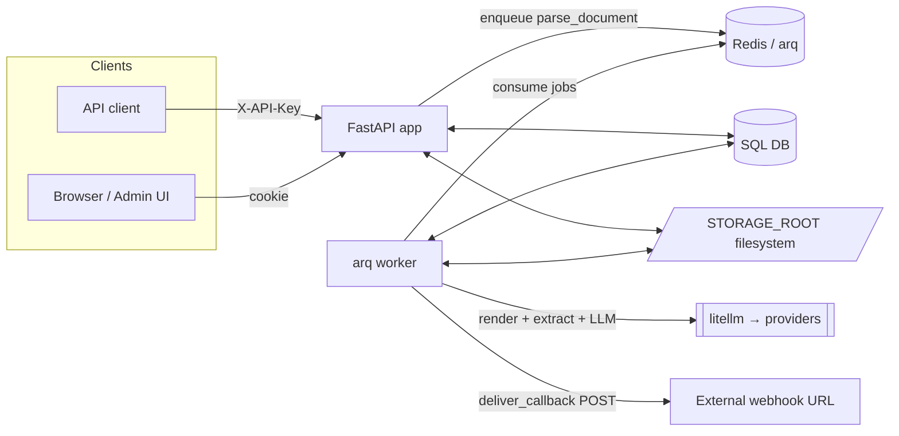

# 01 · Overview

## What it is

`pdf-parser` is an **async, AI-powered PDF parsing service**. You upload a PDF and get
back its text, organized page-by-page, document-wide, and (optionally) as structured
**sections** driven by a user-defined extraction **rule**. It exposes both a JSON HTTP
API and a minimal server-rendered admin UI.

It is sized for **whole-book parsing** (up to `MAX_PAGES`, default 1000). Pages stream
through the pipeline one at a time and are committed to the database as soon as they are
parsed, so progress is visible mid-job and the worker is **resumable** if it crashes.

## The default parsing pipeline

For each page: **300 DPI render → vision LLM + `pdfplumber` text → LLM consolidation**.
Optionally, a markdown **rule** then drives structured extraction over the consolidated
text. On upload you may pass a one-shot `callback_url` to be notified (with retries) when
processing finishes. See [06 · Parsing pipeline](06-parsing-pipeline.md).

## Stack

| Concern | Choice |
| ------- | ------ |
| Language / tooling | Python 3.12, [uv](https://docs.astral.sh/uv/) managed |
| Web framework | FastAPI |
| Async ORM | SQLAlchemy 2.0 (async) |
| Database | PostgreSQL (Docker) · SQLite (local quick start) |
| Background jobs | [arq](https://arq-docs.helpmanual.io/) worker over Redis |
| LLM calls | [litellm](https://docs.litellm.ai/) behind a YAML `ModelRouter` |
| PDF rendering | `pypdfium2` (PDFium, prebuilt wheels) |
| PDF text extraction | `pdfplumber` |
| UI | Jinja2 + HTMX |
| Migrations | Alembic |
| Logging | `structlog` (JSON) |
| Packaging / deploy | Docker + Docker Compose |

## Repository layout

```
app/
  api/
    deps.py            # db_session dependency + auth+db composite
    v1/
      documents.py     # /api/v1/documents/* endpoints
      rules.py         # /api/v1/rules/* endpoints (CRUD)
      health.py        # /api/v1/health
  config/
    model_routes.yaml  # providers + per-task model routes
  core/
    settings.py        # pydantic-settings (env vars)
    security.py        # API key auth (header or cookie)
    router.py          # ModelRouter — resolves task → provider/model
    logging.py         # structlog config
    exceptions.py      # AppError / NotFoundError / ConfigError / ProcessingError
  db/
    base.py            # async engine, SessionLocal, Base
    models.py          # Document, Page, Section, Rule, CallbackDelivery
  schemas/             # Pydantic request/response models
    document.py, rule.py, callback.py, common.py
  services/
    storage.py         # LocalStorage (filesystem under STORAGE_ROOT)
    webhooks.py        # callback delivery + HMAC signing + backoff
    pdf/
      pipeline.py      # stream_pages + apply_rule (the orchestration)
      render.py        # pypdfium2 page render + page count
      plumber.py       # pdfplumber text extraction
      llm.py           # litellm chat/vision with retry
      prompts.py       # vision / consolidation / rule prompts
      text.py          # NUL-byte sanitisation for Postgres/non-Latin
  tasks/
    worker.py          # arq WorkerSettings
    queue.py           # arq pool (enqueue side)
    parse.py           # parse_document task (resumable)
    callback.py        # deliver_callback task (retrying)
  ui/
    routes.py          # /ui/* server-rendered routes
    templates/         # base, login, index, document, rules
    static/app.css
  main.py              # create_app() FastAPI factory + lifespan
main.py                # `python main.py` → uvicorn runner
alembic/               # migration env (versions/ empty initially)
Dockerfile             # 2-stage build (uv builder + slim runtime)
docker-compose.yml     # postgres + redis + api + worker
pyproject.toml         # deps + ruff + mypy + pytest config
.env.example           # documented env template
```

> Detailed per-area documentation lives in the other wiki pages; this is the map.

## Glossary

| Term | Meaning |
| ---- | ------- |
| **Document** | An uploaded PDF and all its derived data. |
| **Page** | One page of a document, with `plumber_text`, `vision_text`, and `consolidated_text`. |
| **Section** | A unit produced by rule extraction (e.g. a chapter/question), fanned out from a top-level JSON array. |
| **Rule** | A markdown description of what a PDF is and how to extract structured data from it. |
| **Consolidation** | The LLM step that merges vision output + pdfplumber text into one authoritative page transcription. |
| **Route (model route)** | A named entry in `model_routes.yaml` mapping a task to a provider + model. |
| **Callback / webhook** | A one-shot POST fired to a per-upload `callback_url` when a document completes or fails. |
| **Resume** | Re-running a parse skips pages that already have `consolidated_text`. |

## System at a glance

<!-- human-readable diagram; LLMs may skip -->


Continue to [02 · Architecture](02-architecture.md).
