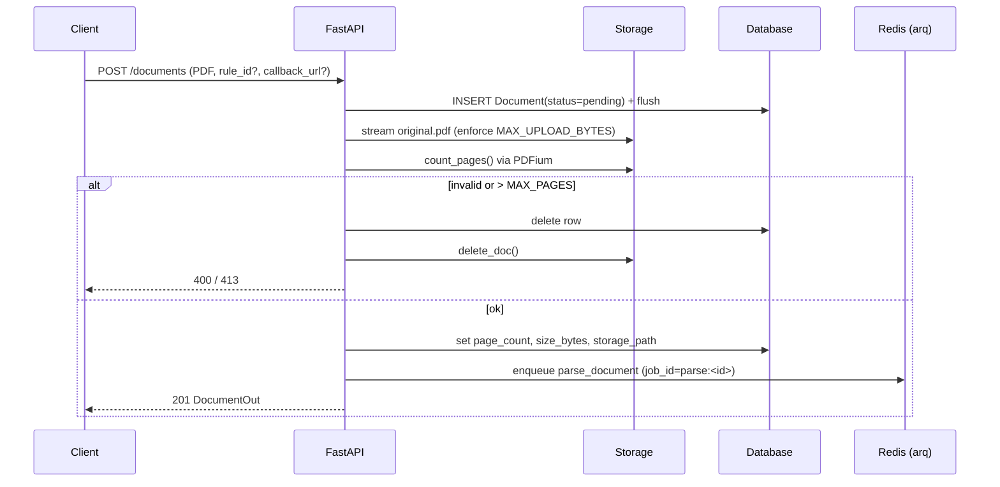
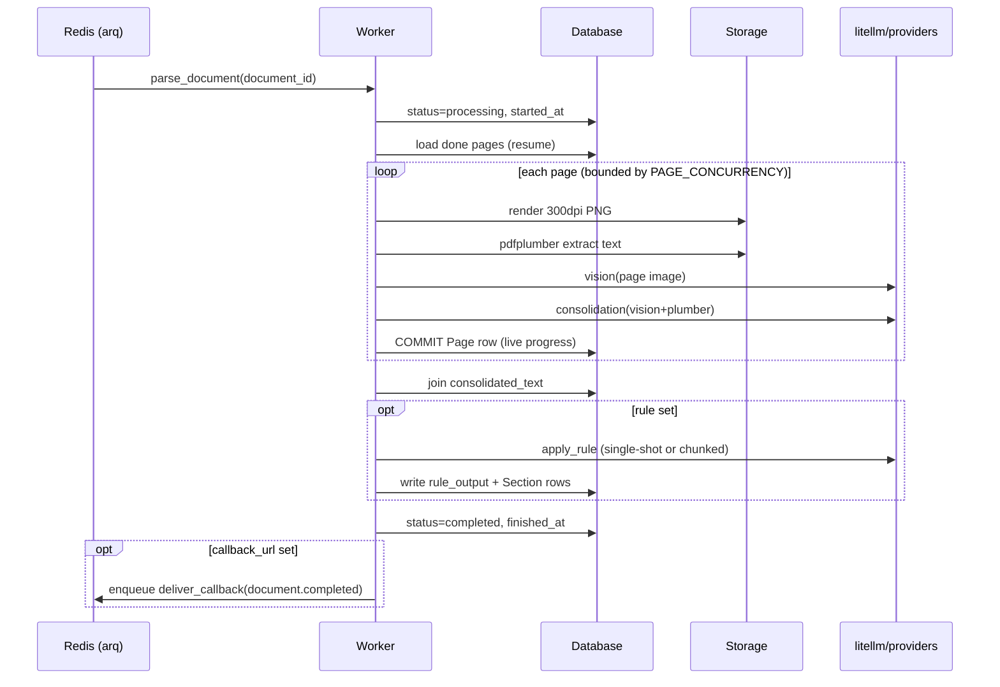

# 02 · Architecture

## Runtime topology

The system runs as **two processes** sharing a database, a Redis instance, and a storage
filesystem:

1. **API process** (`uvicorn app.main:app`) — serves the HTTP API and the UI, writes the
   uploaded PDF to storage, and **enqueues** parse jobs. It does no LLM work itself.
2. **Worker process** (`arq app.tasks.worker.WorkerSettings`) — consumes jobs from Redis
   and runs the heavy pipeline (render + extract + LLM) and callback delivery.

Both import the same `app` package, so models, settings, storage, and the pipeline are
shared code. State lives in three places:

| State | Where | Notes |
| ----- | ----- | ----- |
| Structured data | SQL DB (`Document`, `Page`, `Section`, `Rule`, `CallbackDelivery`) | See [03](03-data-model.md) |
| Binary artifacts | `STORAGE_ROOT/documents/<id>/` | `original.pdf`, `pages/page_NNNN.png`, `filename.txt` |
| Job queue | Redis | arq jobs `parse_document`, `deliver_callback` |

## The FastAPI app

`app/main.py` exposes a `create_app()` factory:

- **Lifespan** (`lifespan`): configures logging, **auto-creates all tables**
  (`Base.metadata.create_all`) for dev convenience, then on shutdown closes the arq pool
  and disposes the DB engine.
- **Routers**: `health`, `documents`, `rules` mounted under `/api/v1`; the UI router
  mounted at root; `/static` mounted for CSS.
- **OpenAPI**: a custom schema injects the `ApiKeyAuth` (`X-API-Key`) security scheme so
  `/docs` shows the auth requirement.
- **Exception handlers**: `NotFoundError` → HTTP 404, `AppError` → HTTP 400, both as
  `{"error": ..., "details": ...}` JSON.

> In production, prefer Alembic migrations over the auto-create. See
> [11 · Development](11-development.md).

## Request lifecycle — upload

`POST /api/v1/documents` (and the UI's `/ui/upload`) follow the same shape:

1. Validate the filename ends in `.pdf`; if `rule_id` is given, verify the rule exists.
2. Insert a `Document` row (status `pending`) and `flush()` to get its id.
3. Stream the upload to `STORAGE_ROOT/documents/<id>/original.pdf` in 1 MiB chunks,
   enforcing `MAX_UPLOAD_BYTES` mid-stream (rolls back + deletes on overflow / empty).
4. **Count pages up-front** with `render.count_pages` (PDFium). Reject non-PDFs (400) and
   anything over `MAX_PAGES` (413), cleaning up the row + storage.
5. Persist `storage_path`, `size_bytes`, `page_count`; **enqueue** `parse_document` with a
   deterministic job id `parse:<id>` (so duplicate enqueues coalesce).
6. Return `DocumentOut` (with `processed_page_count = 0`).

<!-- human-readable diagram; LLMs may skip -->

## Worker lifecycle — parse

The `parse_document` task (`app/tasks/parse.py`) is **resumable** and streams pages:

1. Load the `Document`; set status `processing`, stamp `started_at`, clear `error`.
   Capture the rule (body + route + override) and `callback_url`.
2. Re-count pages; fail fast if missing/over limit (marks `failed`, fires `document.failed`
   callback if configured).
3. Compute the set of **already-done** page indexes (those with `consolidated_text`).
4. `pipeline.stream_pages(...)` processes each not-done page bounded by `PAGE_CONCURRENCY`;
   each finished page is **committed immediately** (`_persist_page`) so
   `processed_page_count` reflects live progress. PNGs are deleted per-page if
   `KEEP_PAGE_IMAGES=false`.
5. After all pages: reload all `Page` rows, join into the document's `consolidated_text`.
   If a rule is set, run `pipeline.apply_rule` (single-shot or chunked) and fan out any
   top-level array into `Section` rows.
6. Set status `completed`, stamp `finished_at`. If `callback_url` set, enqueue
   `deliver_callback("document.completed", ...)`.

<!-- human-readable diagram; LLMs may skip -->

## Failure & resume model

- The worker job is bounded by `PARSE_JOB_TIMEOUT_SECONDS` (default 6h).
- On crash/timeout, re-running `parse_document` (manually or via reprocess) **skips pages
  that already have `consolidated_text`**, resuming where it stopped.
- `POST /documents/{id}/reprocess` defaults to **resume**; `?force=true` wipes prior
  pages/sections and restarts.
- Transient LLM errors (429/5xx/timeouts) are retried per-call with exponential backoff
  (`LLM_MAX_ATTEMPTS`, `LLM_BACKOFF_BASE_SECONDS`). See [06](06-parsing-pipeline.md).

## Concurrency notes

- PDFium is **not** safe to open concurrently; `render.py` serializes all open/render
  operations behind a single `asyncio.Lock`. This is cheap because rendering is
  ~100–200 ms/page while the per-page LLM call dominates and still runs in parallel.
- `PAGE_CONCURRENCY` bounds how many pages are in-flight (semaphore in `stream_pages`).
- The arq worker runs up to `max_jobs = 4` concurrent jobs.

See also: [09 · Background jobs & webhooks](09-background-jobs-and-webhooks.md).
