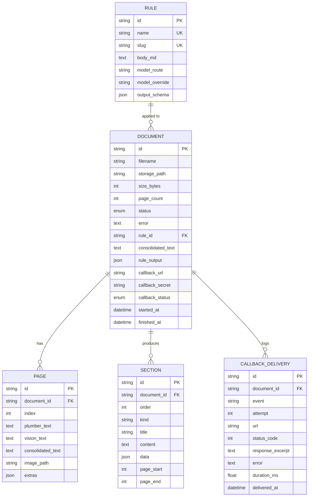
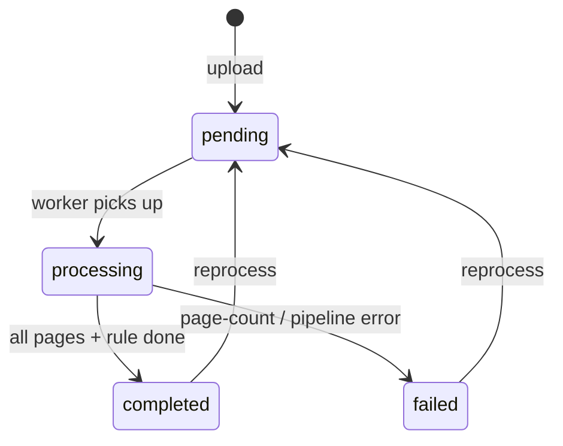
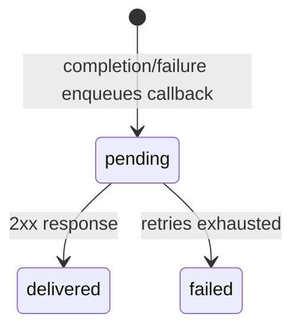

# 03 · Data model

All models live in [`app/db/models.py`](../app/db/models.py). The async engine,
`SessionLocal` session factory, and `Base` live in [`app/db/base.py`](../app/db/base.py).

## Conventions

- **Primary keys** are UUID4 strings (`String(36)`, default `_uuid()`), not integers.
- **`TimestampMixin`** adds `created_at` / `updated_at` (server defaults, `onupdate`).
- **`JsonType`** is a `TypeDecorator` that uses `JSONB` on PostgreSQL and `JSON`
  elsewhere (SQLite). JSON columns are wrapped in `MutableDict.as_mutable(...)` so
  in-place mutations are tracked.
- **Enums** are stored as SQLAlchemy `Enum` types: `document_status`, `callback_status`.
- Child tables use `ForeignKey(..., ondelete="CASCADE")` and ORM
  `cascade="all, delete-orphan"`, so deleting a `Document` removes its pages, sections,
  and callback deliveries.

## Entities

<!-- human-readable diagram; LLMs may skip -->

### `Document` (`documents`)

The central entity: one uploaded PDF and its derived data.

| Column | Type | Notes |
| ------ | ---- | ----- |
| `id` | str (UUID) | PK |
| `filename` | str(512) | Original upload filename |
| `storage_path` | str(1024) | Absolute path to `original.pdf` (set after upload) |
| `size_bytes` | int | Upload size |
| `page_count` | int | Total pages, set up-front after page count |
| `status` | `DocumentStatus` | `pending` → `processing` → `completed`/`failed` |
| `error` | text? | Failure message (truncated to 2000 chars) |
| `rule_id` | str? FK → `rules.id` | Optional extraction rule |
| `consolidated_text` | text? | Whole-document text after parsing |
| `rule_output` | JSON? | Structured rule result (object; arrays wrapped as `{"items": [...]}`) |
| `started_at` / `finished_at` | datetime? | Processing timestamps |
| `callback_url` | str(2048)? | One-shot completion webhook |
| `callback_secret` | str(255)? | HMAC-SHA256 secret for the webhook |
| `callback_status` | `CallbackStatus`? | `pending` → `delivered`/`failed` |

Relationships: `rule`, `pages`, `sections`, `callbacks`.

> Note: `processed_page_count` is **not** a column. It is computed at read time by
> counting `Page` rows that have non-null `consolidated_text` (see
> `_processed_count` in `app/api/v1/documents.py`).

### `Page` (`pages`)

| Column | Type | Notes |
| ------ | ---- | ----- |
| `id` | str (UUID) | PK |
| `document_id` | str FK (CASCADE) | indexed |
| `index` | int | 0-based page index |
| `plumber_text` | text? | Raw `pdfplumber` text (NUL-stripped) |
| `vision_text` | text? | Vision LLM transcription |
| `consolidated_text` | text? | Merged authoritative text — **its presence marks a page "done"** |
| `image_path` | str(1024)? | Path to the rendered PNG (null if `KEEP_PAGE_IMAGES=false`) |
| `extras` | JSON? | Reserved for future per-page metadata |

### `Section` (`sections`)

A unit produced by **rule-driven extraction** — one row per top-level array item the rule
returns. Lets you browse a book chapter-by-chapter / item-by-item.

| Column | Type | Notes |
| ------ | ---- | ----- |
| `order` | int | 0-based position |
| `kind` | str(64) | Default `"section"`; the worker writes `"rule_item"` |
| `title` | str(512)? | Derived from `title`/`name`/`question` keys |
| `content` | text? | Derived from `content`/`text`/`body` keys |
| `data` | JSON? | The full original item |
| `page_start` / `page_end` | int? | Optional page span (not populated by default) |

See [07 · Rules & extraction](07-rules-and-extraction.md) for how items become sections.

### `Rule` (`rules`)

| Column | Type | Notes |
| ------ | ---- | ----- |
| `name` | str(255) | Unique |
| `slug` | str(255) | Unique, `slugify(name)` |
| `description` | text? | |
| `body_md` | text | The markdown rule (required) |
| `model_route` | str(64)? | Named route override (see [08](08-model-routing.md)) |
| `model_override` | str(255)? | Explicit model override |
| `output_schema` | JSON? | Optional JSON schema hint (stored; not enforced) |

### `CallbackDelivery` (`callback_deliveries`)

One row **per delivery attempt** of a document's webhook — an audit trail.

| Column | Type | Notes |
| ------ | ---- | ----- |
| `event` | str(64) | `document.completed` / `document.failed` |
| `attempt` | int | 1-based attempt number |
| `url` | str(2048) | Target URL |
| `status_code` | int? | HTTP response code |
| `response_excerpt` | text? | First 512 chars of the response body |
| `error` | text? | Transport/HTTP error |
| `duration_ms` | float? | Attempt duration |
| `delivered_at` | datetime? | When the attempt completed |

## Status lifecycles

<!-- human-readable diagram; LLMs may skip -->

<!-- human-readable diagram; LLMs may skip -->

## Changing the schema

The app **auto-creates tables** at startup (dev). For any real change, also add an Alembic
migration — see the playbook in [12 · Feature playbooks](12-feature-playbooks.md) and the
migration commands in [11 · Development](11-development.md). Update this page whenever you
add/remove/rename a column or table.
