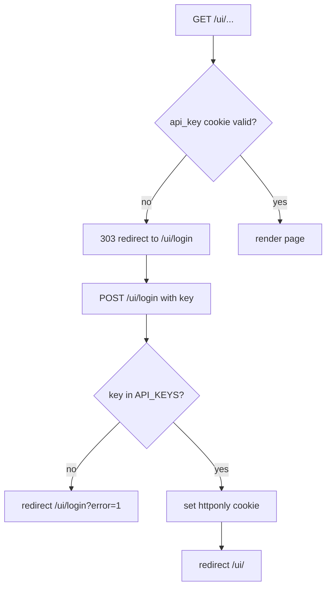

# 05 · UI

A minimal **server-rendered admin UI** (Jinja2 + HTMX) mirrors the most common API
operations. Source: [`app/ui/routes.py`](../app/ui/routes.py); templates in
[`app/ui/templates/`](../app/ui/templates/); styles in
[`app/ui/static/app.css`](../app/ui/static/app.css), mounted at `/static`.

The UI router is included **without** a prefix (routes live at `/`, `/ui/...`) and is
hidden from the OpenAPI schema (`include_in_schema=False`).

## Routes

| Method | Path | Purpose |
| ------ | ---- | ------- |
| GET | `/` | Redirects to `/ui/` |
| GET | `/ui/login` | Login form (`login.html`) |
| POST | `/ui/login` | Validates key, sets `api_key` cookie, redirects to `/ui/` |
| POST | `/ui/logout` | Clears the cookie, redirects to login |
| GET | `/ui/` | Dashboard: latest 50 documents + rules (`index.html`) |
| POST | `/ui/upload` | Upload a PDF (+ optional `rule_id`, `callback_url`, `callback_secret`) |
| GET | `/ui/documents/{id}` | Document detail: pages, sections, callbacks (`document.html`) |
| GET | `/ui/rules` | List rules + create form (`rules.html`) |
| POST | `/ui/rules` | Create a rule |
| POST | `/ui/rules/{id}/delete` | Delete a rule |

## Authentication (cookie-based)

The UI authenticates with the **same API keys** as the HTTP API, stored in an httponly
cookie rather than a header.

- `POST /ui/login` checks the submitted key against `API_KEYS` and, on success, sets
  `api_key` as an **httponly, SameSite=Lax** cookie (7-day max-age).
- Protected pages depend on `_require_ui_auth`, which reads the `api_key` cookie and
  raises a `303` redirect to `/ui/login` if it is missing/invalid.
- Because `require_api_key` (the API dependency) also accepts the `api_key` cookie, a
  logged-in browser can hit the JSON API too.

<!-- human-readable diagram; LLMs may skip -->

## Templates

| Template | Used by | Notes |
| -------- | ------- | ----- |
| `base.html` | all | Layout shell, links HTMX + `app.css` |
| `login.html` | `/ui/login` | Key entry form |
| `index.html` | `/ui/` | Upload form + document/rule lists |
| `document.html` | `/ui/documents/{id}` | Status, pages, sections, callback attempts |
| `rules.html` | `/ui/rules` | Rule list + create form |

## Relationship to the API

The UI upload handler (`ui_upload`) duplicates the core of the API's `upload_document`
(stream to storage → enforce limits → count pages → enqueue `parse_document`). If you
change upload behavior, **update both** handlers. The UI does not re-implement parsing —
it enqueues the same `parse_document` task the API uses.

> When changing UI behavior or templates, update this page. If the change also affects the
> API, update [04 · API reference](04-api-reference.md) too.
