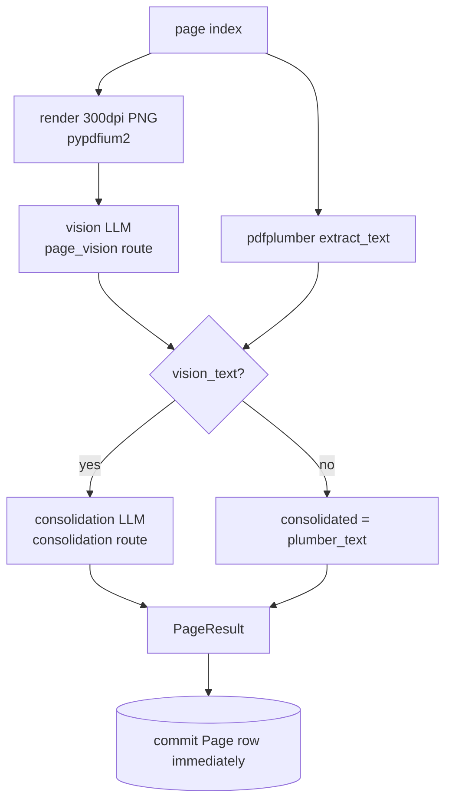

# 06 · Parsing pipeline

This is the heart of the system: turning a PDF into clean, page-wise text. Code lives in
[`app/services/pdf/`](../app/services/pdf/) and is orchestrated by the
`parse_document` worker task ([`app/tasks/parse.py`](../app/tasks/parse.py)).

## The per-page pipeline

For each page index, `pipeline._process_one_page`
([`app/services/pdf/pipeline.py`](../app/services/pdf/pipeline.py)) runs:

1. **Render** — `render.render_page` rasterizes the page to a PNG at `PDF_RENDER_DPI`
   (default 300) via `pypdfium2`, saved as `pages/page_NNNN.png`.
2. **Extract text** — `plumber.extract_page_text` pulls text directly from the PDF with
   `pdfplumber` (exact tokens/numbers, possibly wrong layout). NUL bytes are stripped.
3. **Vision pass** — `llm.vision("page_vision", PAGE_VISION_PROMPT, image)` sends the PNG
   (base64 data URL) to a vision model for a layout-aware transcription. Failures are
   logged and tolerated (`vision_text=""`).
4. **Consolidation** — if vision text exists, `llm.chat("consolidation", ...)` merges
   vision + plumber into one authoritative transcription
   (`CONSOLIDATION_PROMPT_TEMPLATE`). On failure it falls back to `vision_text or
   plumber_text`. If there was no vision text at all, `consolidated = plumber_text`.

The result is a `PageResult(index, plumber_text, vision_text, consolidated_text,
image_path)`.

<!-- human-readable diagram; LLMs may skip -->


## Streaming & concurrency

`pipeline.stream_pages(pdf_path, pages_dir, n_pages, max_concurrency, on_page_complete,
skip_check)`:

- Iterates all page indexes, **skipping** any where `skip_check(idx)` is true (resume).
- Bounds in-flight pages with an `asyncio.Semaphore(max_concurrency)` —
  `max_concurrency = PAGE_CONCURRENCY` (default 4).
- After each page, calls `on_page_complete(result)` so the worker can **persist
  immediately** (`_persist_page`), making `processed_page_count` reflect live progress.
- Returns the count of pages actually processed (excluding skipped).

> **PDFium is not thread-safe.** `render.py` serializes all open/render calls behind a
> single module-level `asyncio.Lock` (`_PDFIUM_LOCK`). This is cheap (render ≈ 100–200 ms)
> because the per-page LLM calls dominate and still run concurrently.

## Persistence & resume

`_persist_page` ([`app/tasks/parse.py`](../app/tasks/parse.py)) upserts the `Page` row
(insert if new, else update), cleaning text with `clean_text`. If
`KEEP_PAGE_IMAGES=false`, the PNG is deleted after the row is committed (and `image_path`
is left null).

A page is considered **done** when its `consolidated_text` is non-null. `_load_done_pages`
loads that set at the start of `parse_document`; `skip_check` skips them. This is what
makes a crashed/timed-out parse resumable.

## Text sanitisation

[`app/services/pdf/text.py`](../app/services/pdf/text.py) strips NUL bytes (`\x00`), which
PostgreSQL `TEXT`/`JSONB` reject and which `pdfplumber` emits for unmapped glyphs in
non-Latin scripts (Hindi, Tamil, CJK, …). `clean_text` handles strings; `clean_jsonable`
recurses through lists/dicts. Apply these to **anything** before persisting.

## Whole-document assembly

After all pages are persisted, the worker reloads `Page` rows in order and builds
`consolidated_text` by joining each page as:

```
# Page <n>

<consolidated_text>
```

If the document has a rule, `apply_rule` runs and may overwrite `full_text` and produce
`rule_output` + sections — see [07 · Rules & extraction](07-rules-and-extraction.md).

## Prompts

All prompts live in [`app/services/pdf/prompts.py`](../app/services/pdf/prompts.py):

| Constant | Used for |
| -------- | -------- |
| `PAGE_VISION_PROMPT` | OCR + layout-aware transcription of a page image |
| `CONSOLIDATION_PROMPT_TEMPLATE` | Merge `{vision_text}` + `{plumber_text}` |
| `RULE_EXTRACTION_PROMPT_TEMPLATE` | Apply `{rule_md}` over `{document_text}` (single-shot) |
| `CHUNKED_RULE_EXTRACTION_PROMPT_TEMPLATE` | Apply a rule to one chunk of a long doc |

When editing a prompt, keep the placeholder names intact — they are `.format()`-ed with
those exact keys. Update this page and [07](07-rules-and-extraction.md) accordingly.

## LLM calls & retries

[`app/services/pdf/llm.py`](../app/services/pdf/llm.py) wraps `litellm`:

- `chat(task, messages, override_model?, route_name?)` and
  `vision(task, prompt, image_path, ...)` both resolve a route via the
  [ModelRouter](08-model-routing.md) and call `litellm.acompletion`.
- `_acompletion_with_retry` retries **transient** errors (rate-limit / timeout / 5xx,
  detected by exception name or message) up to `LLM_MAX_ATTEMPTS` with exponential
  backoff (`LLM_BACKOFF_BASE_SECONDS · 2^(n-1)`, capped at 60s, plus jitter).
- Model name formatting: if the provider is `openai` or the model already contains `/`,
  it is passed through; otherwise it becomes `"{provider}/{model}"` (litellm convention).

## Tuning knobs

| Setting | Effect |
| ------- | ------ |
| `PDF_RENDER_DPI` | Render resolution (higher = sharper, slower, larger PNG) |
| `PAGE_CONCURRENCY` | Parallel in-flight pages |
| `KEEP_PAGE_IMAGES` | Keep or delete PNGs after each page |
| `MAX_PAGES` | Hard upper bound on document size |
| `LLM_MAX_ATTEMPTS`, `LLM_BACKOFF_BASE_SECONDS` | Per-call retry behavior |

See [10 · Configuration](10-configuration.md) for all settings.
