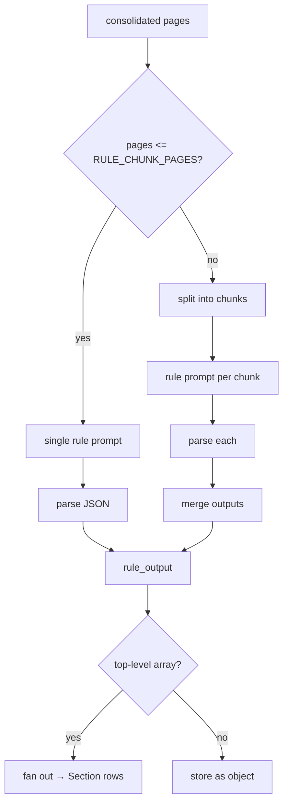

# 07 · Rules & extraction

Beyond plain text, the parser can produce **structured output** driven by a user-defined
**rule**. A rule is *just markdown* describing what the PDF is and how to extract it.

## What a rule is

A `Rule` ([03 · Data model](03-data-model.md)) has:

- `body_md` — the markdown instructions (required).
- `model_route` / `model_override` — optionally override the model used for extraction
  (see [08 · Model routing](08-model-routing.md)).
- `output_schema` — an optional JSON object stored as a hint. **It is not enforced**; the
  prompt asks the model to follow whatever the markdown describes.

Rules are managed via `POST/GET/PATCH/DELETE /api/v1/rules` or the `/ui/rules` page. A
document opts into a rule by passing `rule_id` at upload time.

### Example rule (`body_md`)

```markdown
# Two-column question paper

The PDF is a question paper with English on the **left column** and Hindi on the
**right column**.

- Ignore the cover page and any instructions section.
- Start parsing from the first numbered question.
- For each question return an object with:
  - `number` (int)
  - `english` (string)
  - `hindi` (string)
- Return a JSON array. Do not include surrounding prose or code fences.
```

## How extraction runs

`pipeline.apply_rule(pages, rule_md, rule_model_route, rule_model_override)`
([`app/services/pdf/pipeline.py`](../app/services/pdf/pipeline.py)) runs after all pages
are consolidated:

1. Build `full_text` by joining every page as `# Page <n>\n\n<consolidated_text>`.
2. **If** the document is at most `RULE_CHUNK_PAGES` pages (default 40): run the rule
   **once** over the full text using `RULE_EXTRACTION_PROMPT_TEMPLATE`.
3. **Otherwise (chunked path):** split pages into chunks of `RULE_CHUNK_PAGES`, run each
   chunk independently with `CHUNKED_RULE_EXTRACTION_PROMPT_TEMPLATE`, then **merge**.

The raw model output is parsed by `_parse_rule_json`, which tolerates code fences
(```` ```json ... ``` ````) and, if JSON parsing fails, returns `{"_raw": <text>}` so
nothing is lost.

<!-- human-readable diagram; LLMs may skip -->


## Merge semantics (chunked path)

`_merge_chunk_outputs`:

- If **all** chunk outputs are lists → concatenate into one flat list.
- If **all** are dicts → shallow-merge (later keys win).
- Otherwise → wrap as `{"_chunks": [...]}` to preserve everything.

Per-chunk failures are caught and recorded as `{"_error": "..."}` rather than aborting the
whole run.

## From output to sections

In `parse_document` ([`app/tasks/parse.py`](../app/tasks/parse.py)) after `apply_rule`:

- The output is cleaned with `clean_jsonable` (NUL stripping).
- `document.rule_output` is stored as an **object**: a dict is stored as-is; a list is
  wrapped as `{"items": [...]}`; `None` stays null.
- If the (cleaned) output is a **list**, each item becomes a `Section` row (`kind =
  "rule_item"`, `order = i`). `_section_fields` derives:
  - `title` from `title` / `name` / `question`
  - `content` from `content` / `text` / `body`
  - `data` = the full original item
- Prior sections for the document are deleted first, so re-runs don't duplicate.

Browse sections via `GET /api/v1/documents/{id}/sections[/{order}]`.

## Choosing the model

Extraction is a **text-only** task; by default it uses the `rule_extraction` route in
`model_routes.yaml` (`ollama/glm-5.1:cloud`). Override per rule:

- `model_override` (e.g. `ollama/qwen2.5vl:cloud`) — highest priority.
- `model_route` (a named route) — next.

See [08 · Model routing](08-model-routing.md) for the full resolution order.

## Failure behavior

- If `apply_rule` throws, the worker stores `rule_output = {"_error": "..."}` but the
  document still completes with its `consolidated_text` (text extraction is independent of
  rule success).

> When changing rule behavior, merge logic, section mapping, or the rule prompts, update
> this page and [06 · Parsing pipeline](06-parsing-pipeline.md).
