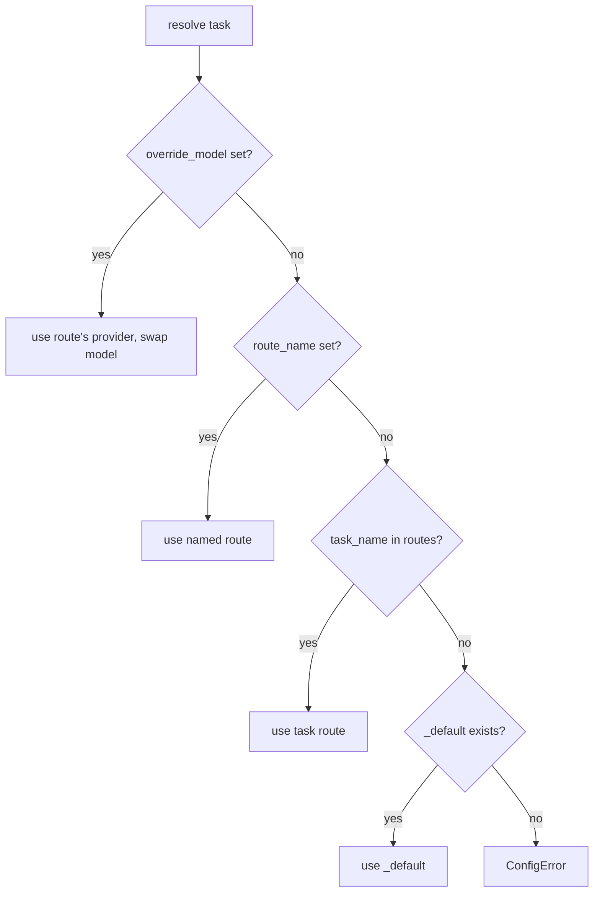

# 08 · Model routing

All LLM calls go through a small **`ModelRouter`** that decides *which provider and model*
to use for a given task. This keeps model choices in one YAML file instead of scattered
through the code.

- Config: [`app/config/model_routes.yaml`](../app/config/model_routes.yaml)
- Resolver: [`app/core/router.py`](../app/core/router.py)
- Callers: [`app/services/pdf/llm.py`](../app/services/pdf/llm.py) (`chat`, `vision`)

## The YAML structure

```yaml
providers:
  ollama:
    type: litellm
    api_key_env: OLLAMA_API_KEY      # env var that holds the key
    base_url: https://ollama.com
  openai:
    type: litellm
    api_key_env: OPENAI_API_KEY
    base_url: https://api.openai.com/v1
  # ... anthropic, gemini, mistral

routes:
  page_vision:                       # task name → route
    provider: ollama
    model: minimax-m3:cloud
    temperature: 0.1
  consolidation:
    provider: ollama
    model: glm-5.1:cloud
    temperature: 0.0
  rule_extraction:
    provider: ollama
    model: glm-5.1:cloud
    temperature: 0.0
  _default:                          # fallback for any unlisted task
    provider: ollama
    model: glm-5.1:cloud
```

- **`providers`** — connection info. `api_key_env` names the env var read at resolve time
  (`OLLAMA_API_KEY`, etc.); `base_url` is the API endpoint. `type` is currently always
  `litellm`.
- **`routes`** — one entry per **task name** used in code (`page_vision`, `consolidation`,
  `rule_extraction`), plus `_default`. Extra keys like `temperature` / `max_tokens` /
  `top_p` are passed through to litellm.

## Task names used in code

| Task | Where called | Default route |
| ---- | ------------ | ------------- |
| `page_vision` | `pipeline._process_one_page` (vision pass) | `ollama/minimax-m3:cloud` |
| `consolidation` | `pipeline._process_one_page` (merge step) | `ollama/glm-5.1:cloud` |
| `rule_extraction` | `pipeline.apply_rule` (single + chunked) | `ollama/glm-5.1:cloud` |

`page_vision` **must** be a vision-capable model. `consolidation` and `rule_extraction`
are text-only, so they default to a cheaper text model.

## Resolution order

`ModelRouter.resolve(task_name, override_model?, route_name?)` picks the route by, highest
priority first:

1. **Explicit model override** — `override_model` (e.g. a rule's `model_override`).
   Replaces the model on the chosen route.
2. **Named route override** — `route_name` (e.g. a rule's `model_route`) selects a
   specific entry from `routes`.
3. **Task default** — the route whose key equals `task_name`.
4. **Global `_default`** — used if `task_name` isn't in `routes`.

<!-- human-readable diagram; LLMs may skip -->


It returns a `ResolvedRoute(provider_type, provider, api_key, base_url, model, params)`.
The API key is read from `os.environ[provider.api_key_env]` at resolve time — so a missing
key surfaces as an empty key, not a config crash. Unknown provider/route → `ConfigError`
(→ HTTP 400 via the exception handler when surfaced through the API).

The router is a lazily-created singleton (`get_router()`), loaded from
`settings.model_routes_path` if set, else the bundled YAML.

## Common changes

- **Swap the vision/consolidation model:** edit the `model:` (and optionally provider) of
  the relevant route in `model_routes.yaml`.
- **Add a provider:** add a `providers.<name>` block (with `api_key_env`, `base_url`), set
  that env var, then reference it from a route. Mirror the key in `.env.example`.
- **Override per rule:** set `model_override` or `model_route` on the `Rule`.

See the "Add an LLM provider / route / swap a model" recipe in
[12 · Feature playbooks](12-feature-playbooks.md). Tests for resolution live in
[`tests/test_router.py`](../tests/test_router.py) — extend them when you change resolution
logic.

> Update this page whenever you add a provider, add/rename a task route, or change the
> resolution order.
