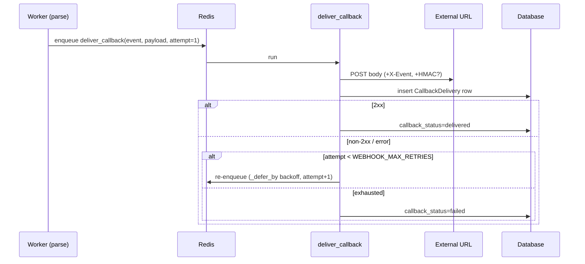

# 09 · Background jobs & webhooks

Heavy work runs out-of-band in an **arq** worker over Redis, decoupled from the API
request. There are two jobs: `parse_document` and `deliver_callback`.

## Worker setup

- [`app/tasks/worker.py`](../app/tasks/worker.py) — `WorkerSettings`:
  - `functions = [parse_document, deliver_callback]`
  - `redis_settings` from `REDIS_URL`
  - `max_jobs = 4` (concurrent jobs)
  - `keep_result = 3600` (seconds)
  - `job_timeout = PARSE_JOB_TIMEOUT_SECONDS` (default 6h — sized for whole books)
  - `on_startup` reconfigures logging
- [`app/tasks/queue.py`](../app/tasks/queue.py) — the **enqueue side**: a lazily-created
  arq pool (`get_queue()`), closed on app shutdown (`close_queue()`).

Run it with `arq app.tasks.worker.WorkerSettings` (see [11 · Development](11-development.md)).

## `parse_document(ctx, document_id)`

The main pipeline driver. Covered end-to-end in
[02 · Architecture](02-architecture.md#worker-lifecycle--parse) and
[06 · Parsing pipeline](06-parsing-pipeline.md). Key properties:

- **Enqueued** by uploads with job id `parse:<id>` (dedup) and by reprocess with a
  timestamped id.
- **Resumable** — skips pages that already have `consolidated_text`.
- On success: status `completed`, then enqueues `deliver_callback("document.completed")`
  if a `callback_url` is set.
- On failure: `_mark_failed` sets status `failed` + `error`, and enqueues
  `deliver_callback("document.failed")` if a `callback_url` is set.

## Webhooks / callbacks

A **one-shot per-upload** webhook. Provide `callback_url` (and optionally
`callback_secret`) at upload. On completion/failure the system POSTs JSON and records every
attempt as a `CallbackDelivery` row.

### Payload

```json
{
  "event": "document.completed",
  "document_id": "…",
  "data": { "page_count": 12, "has_rule_output": true }
}
```

- `document.completed` → `data` has `page_count`, `has_rule_output`.
- `document.failed` → `data` has `error` (truncated).

### Headers

| Header | Always? | Value |
| ------ | ------- | ----- |
| `Content-Type` | yes | `application/json` |
| `X-Event` | yes | The event name |
| `X-Signature-Sha256` | only if `callback_secret` set | HMAC-SHA256 of the raw body |

Verify the signature by computing `hmac_sha256(callback_secret, raw_body)` and comparing
to `X-Signature-Sha256`. Source: `_sign` in
[`app/services/webhooks.py`](../app/services/webhooks.py).

### Delivery & retries

[`app/tasks/callback.py`](../app/tasks/callback.py) (`deliver_callback`) +
[`app/services/webhooks.py`](../app/services/webhooks.py) (`attempt_callback`):

1. `attempt_callback` POSTs the body (timeout `WEBHOOK_TIMEOUT_SECONDS`), writes a
   `CallbackDelivery` row (status code, response excerpt, error, duration), and updates
   `document.callback_status`.
2. A `2xx` → success (`callback_status = delivered`). Otherwise the job re-enqueues itself
   with `_defer_by = next_backoff_seconds(attempt)` (exponential: base·2^(n-1), capped at
   300s) until `WEBHOOK_MAX_RETRIES`, after which `callback_status = failed`.

<!-- human-readable diagram; LLMs may skip -->


Inspect attempts via `GET /api/v1/documents/{id}/callbacks`.

## Relevant settings

| Setting | Meaning |
| ------- | ------- |
| `REDIS_URL` | arq broker |
| `PARSE_JOB_TIMEOUT_SECONDS` | Max runtime for one parse job (default 6h) |
| `WEBHOOK_TIMEOUT_SECONDS` | Per-POST timeout |
| `WEBHOOK_MAX_RETRIES` | Max delivery attempts |
| `WEBHOOK_BACKOFF_BASE_SECONDS` | Backoff base (2, 4, 8, … capped 300s) |

See [10 · Configuration](10-configuration.md).

> When adding a new job, callback event, or changing retry/backoff behavior, update this
> page (and [03 · Data model](03-data-model.md) if `CallbackDelivery` changes).
